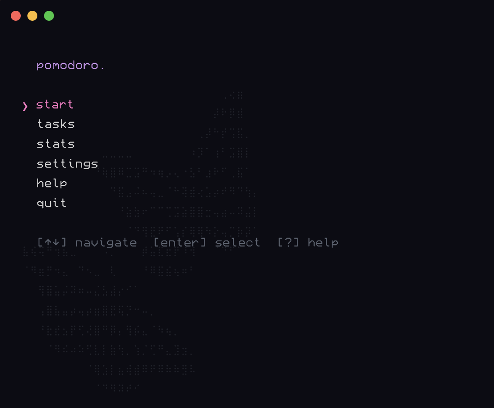
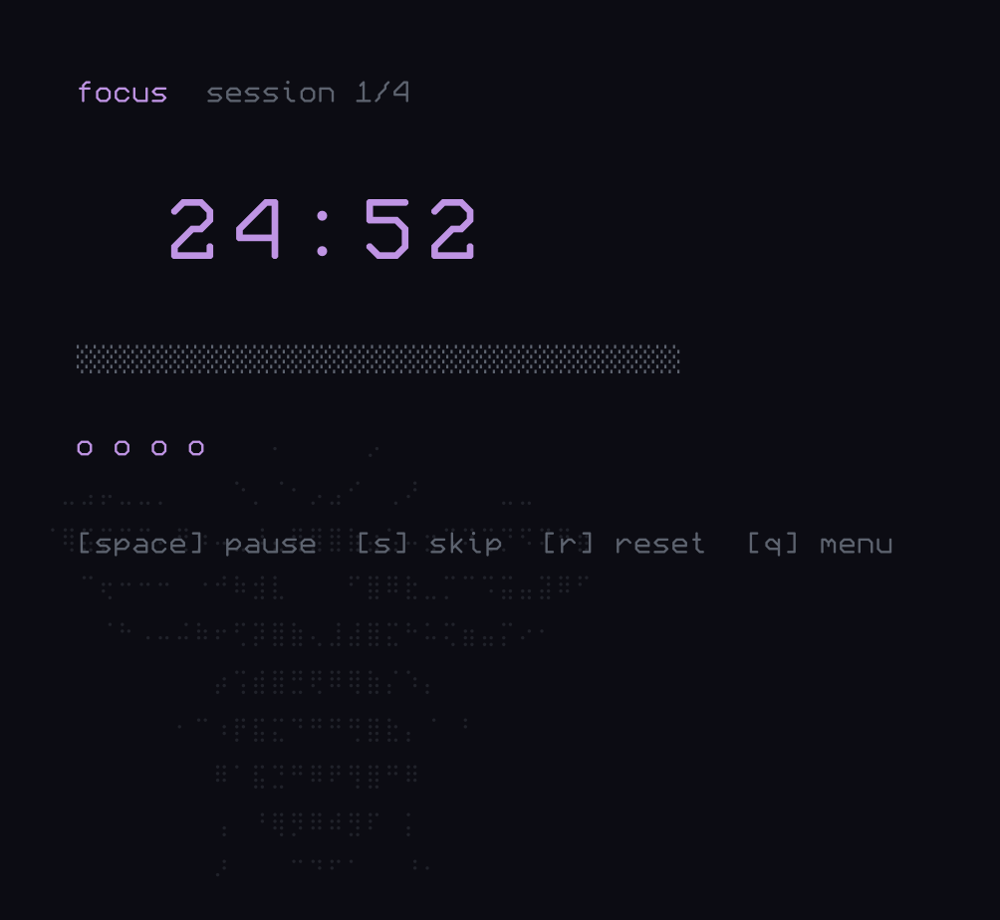
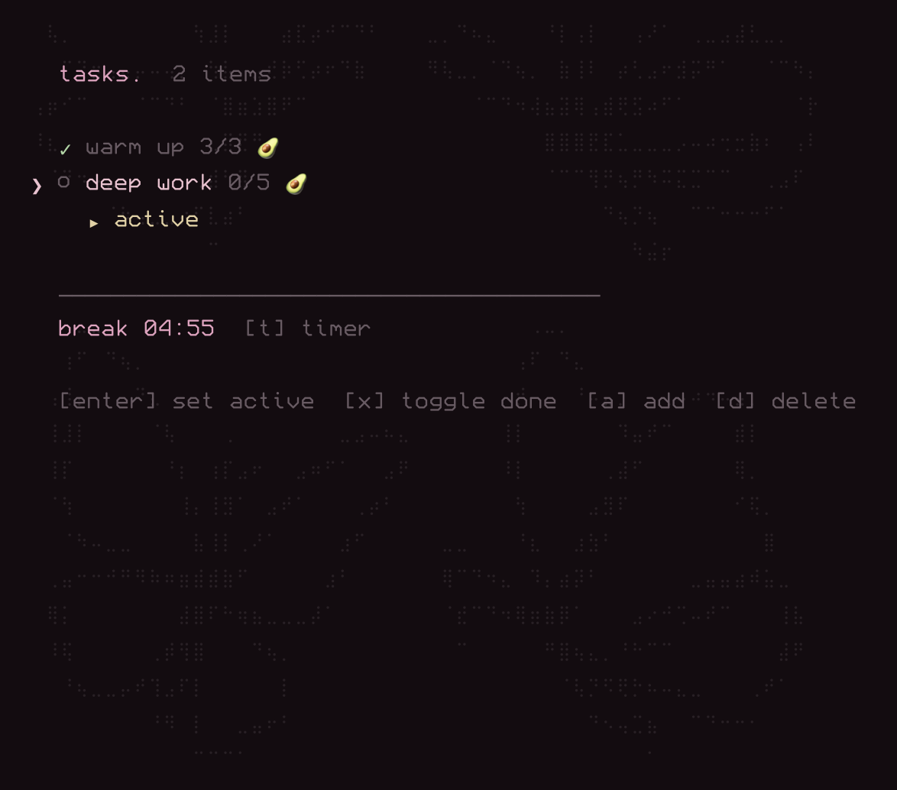
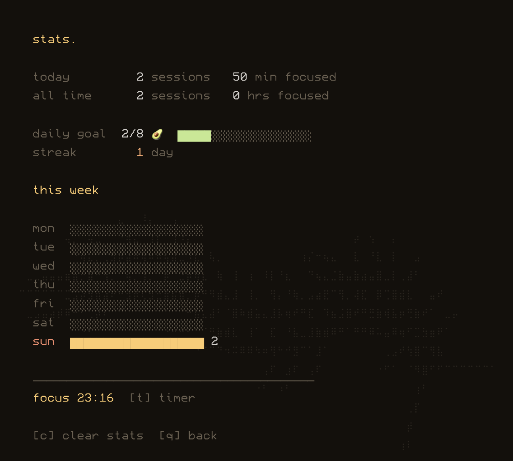
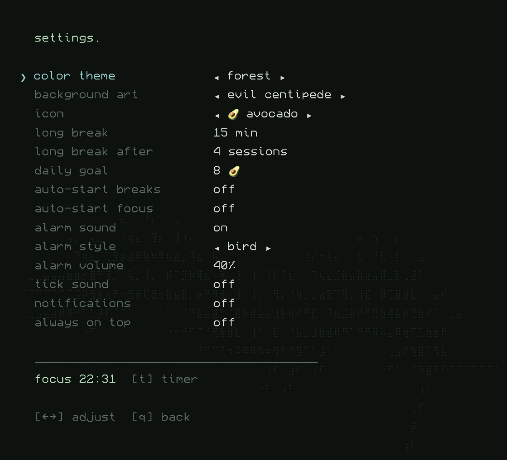

# pomodoro

A terminal-style Pomodoro timer desktop app for programmers. Built with Electron, styled like a CLI using the [Miracode](https://github.com/IdreesInc/Miracode) monospace font.



## Prerequisites

- [Node.js](https://nodejs.org/) (v18 or later)

## Run

```bash
npm install
npm start
```

## Navigation

| Key | Action |
|---|---|
| `↑` `↓` or `j` `k` | Navigate menus |
| `Enter` | Select |
| `←` `→` or `h` `l` | Adjust setting values |
| `q` or `Esc` | Go back |
| `Space` | Start / pause / resume timer |
| `s` | Skip current session |
| `r` | Reset timer |
| `t` | Jump to running timer from any screen |
| `⌘ + Shift + P` | Show/hide window (global shortcut) |

## Screens

### Main Menu

Choose between `start`, `tasks`, `stats`, `settings`, and `quit`.

### Split Select

Pick a work/break split before starting:

- `25/5` — classic pomodoro
- `50/10` — deep focus
- `90/20` — marathon
- `custom...` — enter any split (e.g. `30/10`)

### Timer

Displays a large countdown, progress bar, session dots, and active task. Auto-cycles through work and break sessions. After completing a full cycle (default 4 sessions), triggers a long break.



### Tasks

Manage a task list with pomodoro estimates.

| Key | Action |
|---|---|
| `Enter` | Set/unset task as active |
| `x` | Toggle task done |
| `a` | Add new task |
| `d` | Delete selected task |

Active tasks show up on the timer screen. Completed pomodoros are tracked per task.



### Stats

Shows today's sessions and minutes, all-time totals, daily goal progress, streak counter, and a weekly ASCII bar chart.

| Key | Action |
|---|---|
| `c` | Clear all statistics |



### Settings

Adjust all values inline with arrow keys.

| Setting | Default | Description |
|---|---|---|
| UI font | Miracode | Cycles through `.ttf` files found in the `fonts/` folder |
| Background art brightness | 25% | Controls the intensity of the background ASCII art |
| Focus duration | 25 min | Length of work sessions |
| Short break | 5 min | Break between work sessions |
| Long break | 15 min | Break after a full cycle |
| Long break after | 4 sessions | Sessions before long break |
| Daily goal | 8 | Target focus sessions per day |
| Auto-start breaks | off | Start breaks automatically |
| Auto-start focus | off | Start work sessions automatically |
| Alarm sound | on | Chime when a session ends |
| Alarm volume | 70% | Volume of the alarm chime |
| Tick sound | off | Subtle tick while timer runs |
| Notifications | on | macOS desktop notifications |
| Always on top | off | Pin window above other apps |



## Menu Bar

When the timer is running, the current mode and countdown display in your macOS menu bar (e.g. `focus 24:59`). Right-click the tray icon for start/pause/skip/reset controls.

## Data

Settings, tasks, and statistics are persisted to a JSON file in `~/Library/Application Support/pomodoro/pomodoro-data.json`.

## Build

```bash
npm run build
```

Produces a `.dmg` in the `dist/` directory.

'dist/Pomodoro-1.0.0-arm64.dmg'
